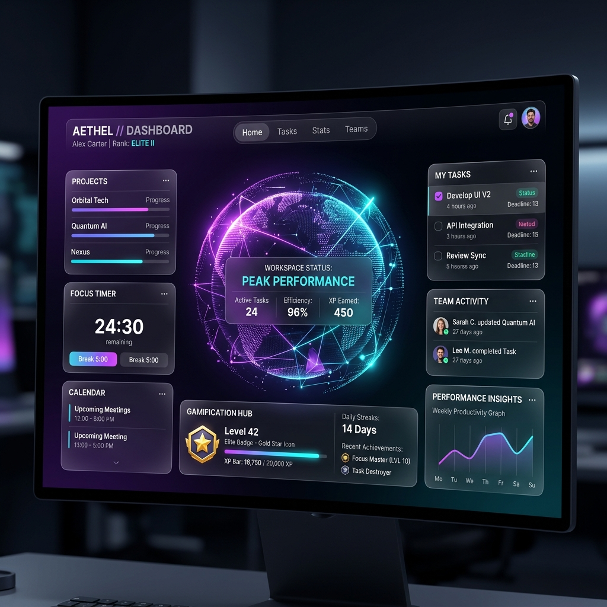

# Last Minute Life Saver (LMLS) ⚡

> *The AI-powered productivity engine that turns procrastination into gamified execution.*



## 🏆 Hackathon Edition (Public Demo Mode)
Want to test the app without signing up? We've built a robust **Public Demo Mode** just for judges!
1. Go to the [Live Demo on Vercel](#)
2. Click **Try Public Demo** on the landing page.
3. You will instantly bypass authentication and be dropped into a fully populated dashboard with mock tasks and analytics data. 

---

## 🔥 Features
- **Predictive Analytics**: Our AI predicts when you will procrastinate based on task deadlines and your historical habits.
- **Emergency Rescue Mode**: When a deadline is under 24 hours away, the AI creates an emergency schedule and locks you into a distraction-free Focus Mode.
- **AI Task Breakdown (Gemini 2.5 Flash)**: Automatically breaks down vague or overwhelming tasks into 3-5 actionable subtasks to eliminate onboarding friction.
- **Immersive 3D UI**: Built with Framer Motion and React Three Fiber. Features an animated Digital Twin, floating tasks, and glowing data rings. (Includes an auto-fallback Error Boundary for older devices).
- **Gamified Productivity**: Complete Pomodoro sessions and tasks to earn XP, level up, and maintain your Focus Streak.

## 🛠️ Tech Stack
- **Frontend**: Next.js 14 (App Router), React, Tailwind CSS, Framer Motion, React Three Fiber.
- **Backend**: Node.js, Express, Prisma, PostgreSQL.
- **Authentication**: Clerk (with custom middleware bypass for Demo Mode).
- **AI Integration**: Google Gemini API.

## Live Demo
Check out the live deployment here: https://last-minute-saver-mh1fa3awn-rohit200573-commits-projects.vercel.app/

## Getting Started

### Prerequisites
- Node.js (v18+)
- PostgreSQL Database
- Clerk Account (for auth)
- Gemini API Key

### 1. Setup Frontend
```bash
git clone https://github.com/your-username/last-minute-saver.git
cd last-minute-saver/frontend
npm install
# Configure your .env.local with Clerk keys
npm run dev
```

### 2. Setup Backend
```bash
cd ../backend
npm install
# Configure your .env with DATABASE_URL and GEMINI_API_KEY
npx prisma db push
npm run dev
```
Open `http://localhost:3000` in your browser.

## 🚀 Deployment
This app is architected for production:
- **Frontend (Vercel)**: Connect your repo, set the Root Directory to `frontend`.
- **Backend (Render)**: We have provided a `render.yaml` Blueprint for instant, zero-config deployment of the Express/Prisma backend.

---
*Built to save your life at the last minute.*
